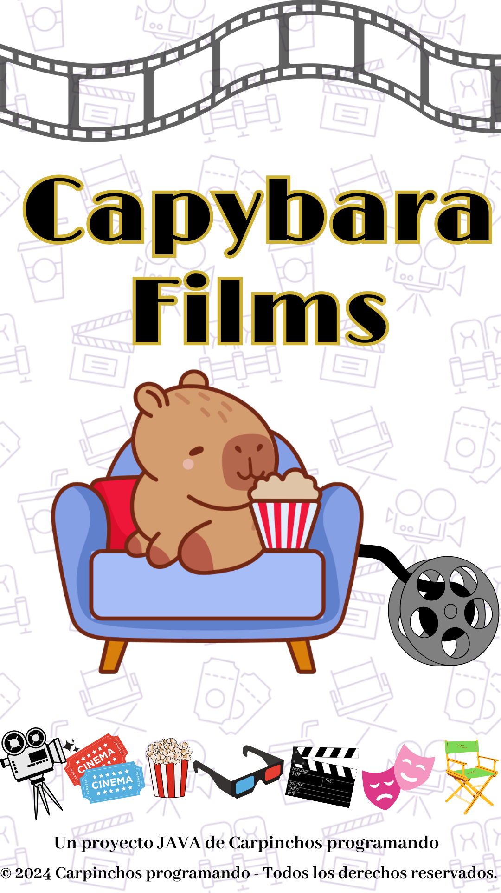
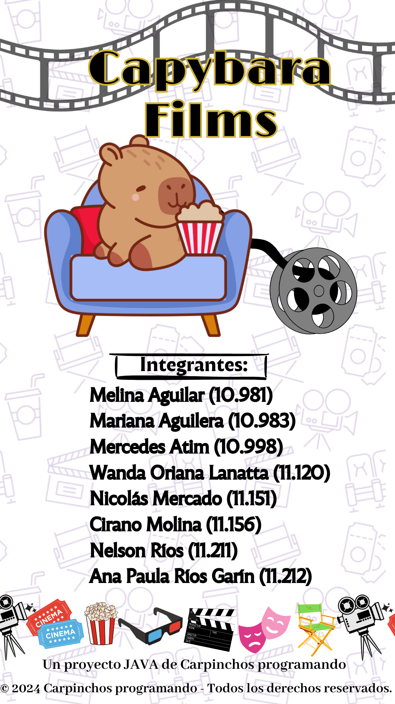

# CAPYBARA FIMS de Carpinchos Programando

# Proyecto Cine en Java

## Descripción

Este proyecto tiene como objetivo desarrollar un sistema de gestión de cine en Java. El sistema permite gestionar películas, salas, butacas, reservas y clientes. Los usuarios pueden realizar reservas, consultar la disponibilidad de butacas, y gestionar la programación de películas.

## Objetivos del Proyecto

- **Gestionar** la información sobre películas, salas y butacas.
- **Realizar** reservas para clientes en diferentes salas y películas.
- **Consultar** la disponibilidad de butacas y la programación de películas.

## Integrantes del Equipo

- **Melina Aguilar** (10.981) *Desarrolladora*
- **Mariana Aguilera** (10.983) *Desarrolladora*
- **Mercedes Atim** (10.998) *Desarrolladora*
- **Wanda Oriana Lanatta** (11.120) *Desarrolladora*
- **Nicolás Mercado** (11.151) *Desarrollador*
- **Cirano Molina** (11.156) *Desarrollador*
- **Nelson Ríos** (11.211) *Desarrollador*
- **Ana Paula Ríos Garín** (11.212) *Desarrolladora*

## Contenidos de la Wiki

- [Guía de Inicio](Guía-de-Inicio.md): Instrucciones para configurar el entorno de desarrollo y ejecutar el proyecto.
- [Modelo del Proyecto](Modelo-del-Proyecto.md): Descripción de las clases principales (`Pelicula`, `Sala`, `Butaca`, `Reserva`, `Cliente`).
- [Estructura del Proyecto](Estructura-del-Proyecto.md): Detalles sobre la organización del proyecto y los diagramas UML.
- [Uso del Sistema](Uso-del-Sistema.md): Instrucciones para usar el sistema, incluyendo cómo hacer reservas y gestionar películas.
- [Documentación Técnica](Documentación-Técnica.md): Información técnica sobre algoritmos, estructuras de datos.
- [Problemas Conocidos y Soluciones](Problemas-Conocidos.md): Lista de errores comunes y soluciones.
- [Historial de Cambios](Historial-de-Cambios.md): Registro de versiones y cambios realizados en el proyecto.

## Contacto

Para cualquier duda o comentario, puedes contactar a los integrantes del equipo a través del grupo de chat del proyecto.
